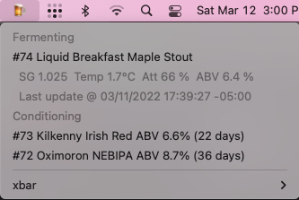

# BrewFather Plugin for xbar

[xbar](https://github.com/matryer/xbar) plugin for [Brewfather](https://brewfather.app/).



This plugin shows the brews that are currently fermenting and the ones that are being conditioned.

## Requirements

* macOS 10.15+
* [xbar](https://github.com/matryer/xbar)
* [.NET 6](https://dotnet.microsoft.com/en-us/download/dotnet/6.0)

## Build

```bash
$ dotnet publish
Microsoft (R) Build Engine version 17.1.0+ae57d105c for .NET
Copyright (C) Microsoft Corporation. All rights reserved.

  Determining projects to restore...
  All projects are up-to-date for restore.
  brewfather -> /Users/poupou/git/bitbar-plugins/brewfather/bin/Debug/net6.0/brewfather.dll
  brewfather -> /Users/poupou/git/bitbar-plugins/brewfather/bin/Debug/net6.0/publish/
```

## Setup

Example script `~/Library/Application Support/xbar/plugins/brewfather.15m.sh`

```bash
#!/bin/bash
/usr/local/share/dotnet/dotnet ~/git/bitbar-plugins/brewfather/bin/Debug/net6.0/publish/brewfather.dll
```

The `.15m.` part of script name tells xbar to execute the plugin every 15 minutes.

Note: The fifteen minutes interval was chosen because it is the smallest interval that Brewfather allows to receive data to update the gravity and temperature from a beer being fermented.

## Authentication

The `uid` and `key` to query brewfather.app are stored in a local `~/.brewfather` file. 
The format is: `uid`:`key`

Note: Both on a **single** line, IOW **no** extra new line.

## See Also

* [Tilt Relay](https://github.com/spouliot/tilt-relay) to send your Tilt hydrometers data to brewfather using an ESP32 microcontroller
